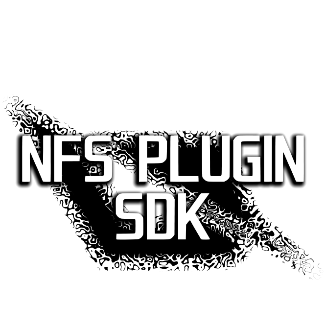

</table>

# NFSPluginSDK 

An attempt to reverse compiled types of BlackBox era Need for Speed games to allow creating plugins/scipt mods easily.

Given the workload of finding leaked builds, cross-referencing compiled code, finding references to the variables inside structures and hand-crafting each structure; and also working alone, some structures may not feature all of their features and/or have missing functions/variables. However, NFSPluginSDK is mature enough to be used as a base. [NFS Chat Chaos Mod](https://github.com/berkayylmao/NFS-Chat-Chaos-Mod) and [B.A.M.](https://github.com/berkayylmao/BerkaysAssortedMods) already use it.

| Game                 | Progress |       Attrib       |      PVehicle      |     AIVehicle      |     \*Pursuit      |
| :------------------- | :------: | :----------------: | :----------------: | :----------------: | :----------------: |
| NFS Most Wanted 2005 |   ≈60%   | :white_check_mark: | :white_check_mark: | :white_check_mark: | :white_check_mark: |
| NFS Carbon           |   ≈20%   | :white_check_mark: | :white_check_mark: | :white_check_mark: | :white_check_mark: |
| NFS ProStreet        |   ≈70%   | :white_check_mark: | :white_check_mark: |                    |                    |

## Usage
NFSPluginSDK does not need a seperate build, it's only a bunch of header files. Simply add it to your C++14 (or above) project, `#include` it and enjoy!

The easiest way to use NFSPluginSDK is to add it as a submodule.

`> git submodule add https://github.com/berkayylmao/NFSPluginSDK`

Include the header of the game you are working with.

`#include <NFSPluginSDK/NFSPluginSDK/Game.MW05/MW05.h>`

And use it!

`MW05::Game::BlowEngine(MW05::PlayerEx::GetPlayerInstance());`

For more advanced example you can take a look at the source code of [NFS Chat Chaos Mod](https://github.com/berkayylmao/NFS-Chat-Chaos-Mod) and [B.A.M.](https://github.com/berkayylmao/BerkaysAssortedMods).

## Thanks
Massive thanks to nlgzgrn and heyitsleo for all their help.

## Legal
OpenNFS is not affiliated in any way with EA.

Released under the AGPL-3.0 License.
